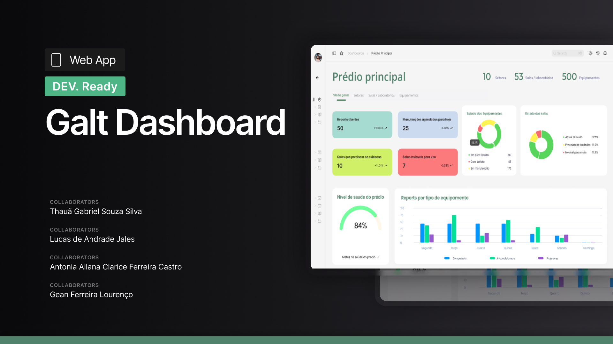

# GALT – Sistema de Gerenciamento de Equipamentos e Salas

### Descrição

O GALT é um sistema web desenvolvido para otimizar a gestão de equipamentos, salas e laboratórios em instituições de ensino. Ele centraliza informações sobre o estado dos recursos, permitindo abertura de chamados, acompanhamento de manutenções e geração de métricas de uso e falhas. A interface é responsiva, garantindo acessibilidade tanto em desktops quanto em dispositivos móveis, e oferece diferentes níveis de acesso para alunos, professores, técnicos de TI e administradores.

### O que o sistema faz

O GALT permite que alunos e professores registrem problemas com equipamentos de forma prática, abrindo chamados de manutenção rapidamente. Técnicos de TI podem acompanhar esses chamados, atualizar o estado dos equipamentos e agendar períodos de manutenção, tornando seu trabalho mais simples, pois o sistema gerencia automaticamente mudanças de estado de equipamentos conforme o resultado das manutenções. Dessa forma, os técnicos podem focar apenas na execução das tarefas de manutenção, enquanto o sistema garante que o estado de cada recurso esteja sempre atualizado e correto.

O sistema oferece ainda leitura de QR Codes para acesso rápido às informações de cada equipamento, exibição de plantas das salas com cores indicando o estado dos equipamentos, notificações automáticas por email quando problemas são resolvidos e geração de relatórios e métricas detalhadas sobre histórico de falhas e tempo de atendimento. Todas as alterações são registradas em logs auditáveis, garantindo rastreabilidade e transparência em todas as operações. Além disso, o GALT organiza de maneira eficiente a estrutura de gestão de recursos, permitindo associar equipamentos a salas, salas a setores e setores a prédios, criando um mapeamento completo da instituição e centralizando a comunicação e controle de todos os usuários.

 

## Documentação e Recursos
[Documento de Requisitos do Sistema (PDF/MD)](link-do-documento)  
[Protótipo Figma](https://www.figma.com/community/file/1557802063496441585/galt-gerenciador-de-manutencao-de-equipamentos-eletronicos)  
[Relatórios de Métricas e Chamados](link-relatorios)  

 

### Stack Tecnológica 
**Backend:** Django (Python)  
**Banco de Dados:** PostgreSQL  
**Frontend:** HTML, CSS, JavaScript  
**Outros:** QR Code scanning, sistema de notificações por email  

 
 

| Feature | Status | Descrição |
|---------|:------:|-----------|
| Cadastro de usuários com diferentes níveis de acesso | ❌ Não Implementada | Admin, Técnico de TI, Professor e Aluno com permissões distintas |
| CRUD de salas | ❌ Não Implementada | Criação, atualização, consulta e exclusão de salas |
| CRUD de equipamentos | ❌ Não Implementada | Cadastro de tipo, modelo, posição na sala, estado e histórico de manutenção |
| CRUD de setores | ❌ Não Implementada | Criação e gerenciamento de setores associados a prédios |
| CRUD de prédios | ❌ Não Implementada | Gerenciamento de prédios e associação com setores e salas |
| Associação entre salas, setores e prédios | ❌ Não Implementada | Relacionamento entre todos os elementos da instituição |
| Registro de chamados de manutenção | ❌ Não Implementada | Alunos e professores podem abrir chamados facilmente |
| Atualização automática do estado dos equipamentos | ❌ Não Implementada | Mudança de estado para FUNCIONANDO, MANUTENÇÃO ou DEFEITUOSO |
| Agendamentos de manutenção | ❌ Não Implementada | Técnicos podem programar períodos de manutenção para equipamentos |
| Visualização de planta das salas com cores de status | ❌ Não Implementada | Verde = funcionando, amarelo = manutenção, vermelho = defeituoso |
| Notificações por email | ❌ Não Implementada | Alertas enviados quando um equipamento sai de manutenção |
| Logs auditáveis | ❌ Não Implementada | Registro automático de todas as alterações importantes |
| Relatórios e métricas detalhadas | ❌ Não Implementada | Histórico de manutenção, equipamentos mais defeituosos, chamados em aberto |
| Interface móvel responsiva | ❌ Não Implementada | Compatível com celulares e tablets |
| Integração com QR Code para acesso rápido | ❌ Não Implementada | Leitura rápida dos dados de cada equipamento |
| Sistema de feedback e comentários de usuários | ❌ Não Implementada | Espaço para comentários adicionais sobre problemas |

 
 
 

## Contribuidores

<table>
  <tr>
    <td align="center">
      <a href="https://github.com/taagashi">
         
        <b>Thauã Gabriel</b>
      </a>
    </td>
    <td align="center">
      <a href="https://github.com/Lukkasjales">
         
        <b>Lucas Jales</b>
      </a>
    </td>
    <td align="center">
      <a href="https://github.com/Dom-Garotom">
         
        <b>Gean Lourenco</b>
      </a>
    </td>
  </tr>
  <tr>
    <td align="center">
      <a href="https://github.com/allana-clarice">
         
        <b>Antonia Allana</b>
      </a>
    </td>
  </tr>
</table>

 
 

Feito com 💚 pela nossa equipe .